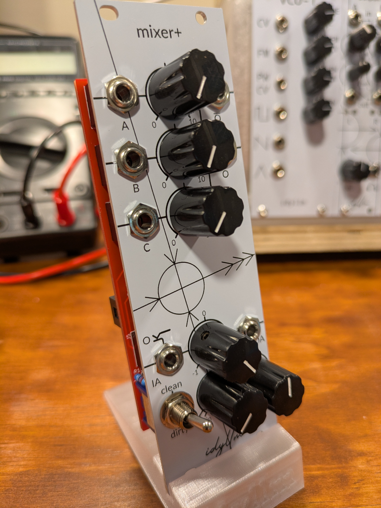

Assembly Guide
==============

Placing Components
------------------

#. Backside resistors: R9, R16 
#. DIP socket: U1
#. Ceramic capacitors: C1-C4, C23, C24
#. 100k resistors: R1-R3, R5-R7, R10-R12
#. 47k resistors: R8, R4, R22, R40
#. Remaining attenuverter resistors: R25, R17, R18
#. Output resistors: R13, R14, R19
#. Power input resistors and electrolytic capacitors:

    * R20, R21 (backside). Alternative: ferite beads
    * C27-C29
    * D3, D4

#. Signal diodes: D1, D2, D5 (backside)
#. Output level indicator circuit:

    * R39-R45
    * Q5, Q6
    * *do not populate LEDs yet*

#. Audio jacks: J1-J3, J5-J8
#. 50k (B503) potentiometer: RV6
#. 100k (B104) potentiometers: 

    * no detent: RV1-RV3, RV5
    * with detent: RV7

#. DPDT switch: SW4

Before adding LEDs (D10 and D11), add the spacing washers for the audio jacks and fit the faceplate

Faceplate and Knobs
-------------------

#. Add 0.6mm M6 nylon washers over the audio jacks.
#. Fit the faceplate and solder the LEDs

    * Insert the LEDs (D10 and D11) in the holes in the PCB (*observe polarity & colour*). 
    * Ensure that the faceplate fits close. It can be secured with nuts for the audio jacks or an elastic while mounting the LEDs
    * Adjust the LEDs so that they project through their holes in the faceplate then solder in place.

#. Attach the faceplate with the nuts for the audio jacks and the switch. An additional washer can be used for the switch on the front of the faceplate.
#. Attach the knobs.

    
