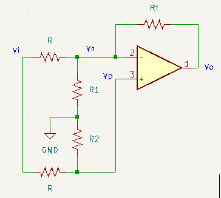

Theory of Operation
===================

Attenuverter
------------

Reference: https://www.befaco.org/dual-atenuverter/

Voltage divider R1-R2 is implemented with a fixed R (:math:`R_1'`) in series with a variable resistor (pot) with max R :math:`R_2'`.

.. math::

    0 &= \frac{V_p - V_i}{R} + \frac{V_p}{R_2} \\
    \to V_p &= \frac{R_2 V_i}{R_2 + R}\quad\mathrm{with}\quad V_p = V_n \\
    0 &= \frac{V_n - V_i}{R} + \frac{V_n}{R_1}+\frac{V_n-V_o}{R_f}  \\
    \to 0 &= V_n - V_i + \frac{R}{R_1}V_n + \frac{R}{R_f}V_n - \frac{R}{R_f}V_o \\
    \to \frac{R}{R_f}V_o &= V_n\left(1 + \frac{R}{R_1} + \frac{R}{R_f}\right) - V_i \\
    \to \frac{R}{R_f}V_o &= \left[\frac{R_2}{R_2 + R}\left(1 + \frac{R}{R_1} + \frac{R}{R_f}\right) - 1 \right]V_i \\
    \mathrm{let}\ R_f &= R \\
    \to V_o &= \left[\frac{R_2}{R_2 + R}\left(\frac{2R_1 +  R}{R_1}\right) - 1 \right]V_i
    

If :math:`R_2=0` (potentiometer wiper is set to the end stop), :math:`V_o = -V_i` . Choosing the maximum potentiometer value to be :math:`R_2'=R` and the remaining fixed resistance :math:`R_1=R_1'` 

.. math::

    2 &= \frac{R_2}{R_2+R}\left(\frac{2R_1 + R}{R_1}\right) = \frac{R}{2R}\left(\frac{2R_1' + R}{R_1'}\right) \\
    \to 4R_1' &= 2R_1' + R \to R_1' = \frac{1}{2}R
    
